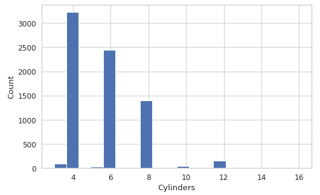
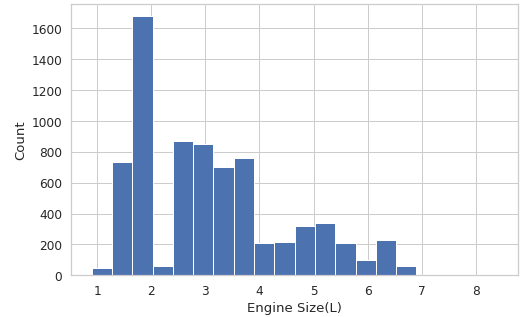
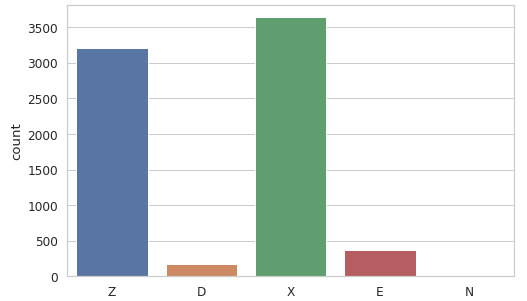
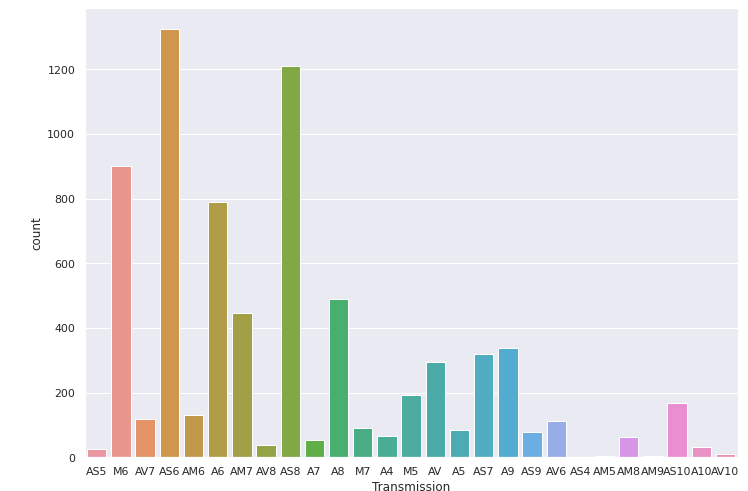
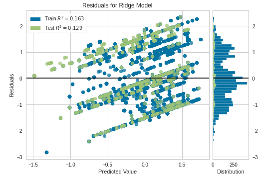

Eric Elsner
CS4200 - Final Project

I defintiely struggled with this project as the understanding of how machine learning works didn't quite leave me confident.

## Prediction of CO2 emission and Fuel Consumption of Vehicles Based on Fuel Type and Engine Specifications.
I've chosen this dataset as it could be useful in a marketing perspective.  Attempting to predict the best combination of engine specifications as well as fuel type in regards to finding a perfect balance for fuel consumption and CO2 emissions. This is useful as there are limits to the amount of CO2 a car can produce whilst trying to make an advertisable fuel economy.

The Engine size column I aggregated into a standard deviation, avg, and min/max as I believe it has the most significant impact on my prediction of emissions. Ive decided that Vehicle Class, Transmission Type, and Fuel type should be label-encoded and the engine size would be one hot encoded.  

After scoring the linear regression I received an accuracy of about 18%. In regards to the residual plot, this surely reflects that accuracy.

I believe the linear model is stronger than the logistics model in regards to my plot as it contains mostly numeric values and is not classification type.  My data being already somewhat predictable make linear regression the better model here.

This project is very interesting but I know I am not taking away the full length of information unfortunately. Theres surely things in this project I need to fix butI honestly don't have the time regarding my other classes.

[CO2 Emissions Canada](https://www.kaggle.com/datasets/debajyotipodder/co2-emission-by-vehicles?resource=download)

### Dataset Descriptor
Fuel type:
- X = regular gasoline
- Z = premium gasoline
- D = diesel
- E = ethanol (E85)
- N = natural gas

### Plots












```
import pandas as pd
import numpy as np
import seaborn as sns
import matplotlib.pyplot as plt
from numpy import random
from datetime import datetime
from sklearn import preprocessing
from sklearn import linear_model
from sklearn.linear_model import Ridge
from google.colab import files
from yellowbrick.datasets import load_concrete
from yellowbrick.regressor import ResidualsPlot
files.upload()
df = pd.read_csv('./CO2 Emissions_Canada.csv')
df = df.drop(['Fuel Consumption City (L/100 km)', 'Fuel Consumption Hwy (L/100 km)', 'Fuel Consumption Comb (L/100 km)'], axis=1)
#plot = sns.lineplot(x='Fuel Consumption Comb (mpg)', y='CO2 Emissions(g/km)', hue='Fuel Type', data=df)
sns.pairplot(df, hue='Fuel Type', kind='kde')
sns.set(style='whitegrid', palette="deep", font_scale=1.1, rc={"figure.figsize": [8, 5]})
sns.distplot(
    df['Engine Size(L)'], norm_hist=False, kde=False, bins=20, hist_kws={"alpha": 1}
).set(xlabel='Engine Size(L)', ylabel='Count');
sns.set(rc={'figure.figsize':(11.7,8.27)})
sns.countplot(df['Transmission'])
le = preprocessing.LabelEncoder()
oh = preprocessing.OneHotEncoder()

df['Transmission'] = le.fit_transform(df['Transmission'])
df['Vehicle Class'] = le.fit_transform(df['Vehicle Class'])
df['Fuel Type'] = le.fit_transform(df['Fuel Type'])
#df['Fuel Type'] = oh.fit_transform(df['Fuel Type'].reshape(-1,1)).toarray()
df['Engine Size STD'] = df['Engine Size(L)'].std()
df['Engine Size MIN'] = df['Engine Size(L)'].agg("min")
df['Engine Size MAX'] = df['Engine Size(L)'].agg("max")
df['Engine Size AVG'] = df['Engine Size(L)'].agg("mean")

test = df.head(750)
train = df.tail(-750)

scaler = preprocessing.StandardScaler()
scaler.fit(train)

train = scaler.transform(train)
test = scaler.transform(test)

y_t = train[:, 3]
y = test[:, 3]

x_t = train[: , [0,1,2,4]]
x = test[: , [0,1,2,4]]

linReg = linear_model.LinearRegression()
logReg = linear_model.LogisticRegression()

linReg.fit(x_t, y_t)
#logReg.fit(x_t, y_t) 

linReg.score(x_t, y_t)
#logReg.score(x_t, y_t)

model = Ridge()
visualizer = ResidualsPlot(model)
visualizer.fit(x_t, y_t)  
visualizer.score(x, y)
visualizer.show()  
```
