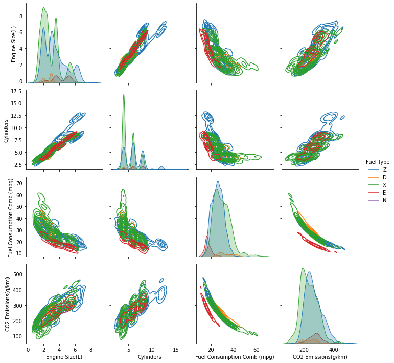

Eric Elsner
CS4200 - Final Project

## Prediction of CO2 emission and Fuel Consumption of Vehicles Based on Fuel Type and Engine Specifications.
I've chosen this dataset as it could be useful in a marketing perspective.  Attempting to predict the best combination of engine specifications as well as fuel type in regards to finding a perfect balance for fuel consumption and CO2 emissions. This is useful as there are limits to the amount of CO2 a car can produce whilst trying to make an advertisable fuel economy.

[CO2 Emissions Canada](https://www.kaggle.com/datasets/debajyotipodder/co2-emission-by-vehicles?resource=download)

### Dataset Descriptor
Fuel type:
- X = regular gasoline
- Z = premium gasoline
- D = diesel
- E = ethanol (E85)
- N = natural gas

### Plots


```
import pandas as pd
import numpy as np
import seaborn as sns
import matplotlib.pyplot as plt
from numpy import random
from datetime import datetime
from sklearn import preprocessing
from google.colab import files
files.upload()
df = pd.read_csv('./CO2 Emissions_Canada.csv')
df = df.drop(['Fuel Consumption City (L/100 km)', 'Fuel Consumption Hwy (L/100 km)', 'Fuel Consumption Comb (L/100 km)'], axis=1)
#plot = sns.lineplot(x='Fuel Consumption Comb (mpg)', y='CO2 Emissions(g/km)', hue='Fuel Type', data=df)
sns.pairplot(df, hue='Fuel Type', kind='kde')
```
